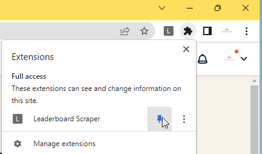
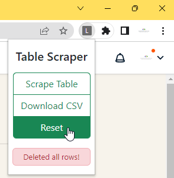

# table-scraper-extension
A Chrome extension that extracts data from tables in webpages and exports it to a CSV file.

## Installation:
1: Download Extension by clicking the Code button on this page and then "Download ZIP"

2: Extract the zip file. 

3: Click on the three dots at the top right of your browser > Click on "More tools" > Click on "Extensions"

4: Turn on developer mode at the top right.

5: Click on load unpacked and select the folder inside the extracted folder earlier.

6: Done! You can now use the scraper.

## Usage:

1: Pin the extension on your toolbar

2: Go to the page with the leaderboards/table

3: Click on "Scrape Table" to scrape the table data in the current page.

4: Go to the next page and click "Scrape Table", repeat for as many tables as you want.

5: Once you're done, click on "Download CSV". You should see the CSV file downloaded.

6: If you made a mistake or you wish to scrape again from the start, just click the "Reset" button. 

